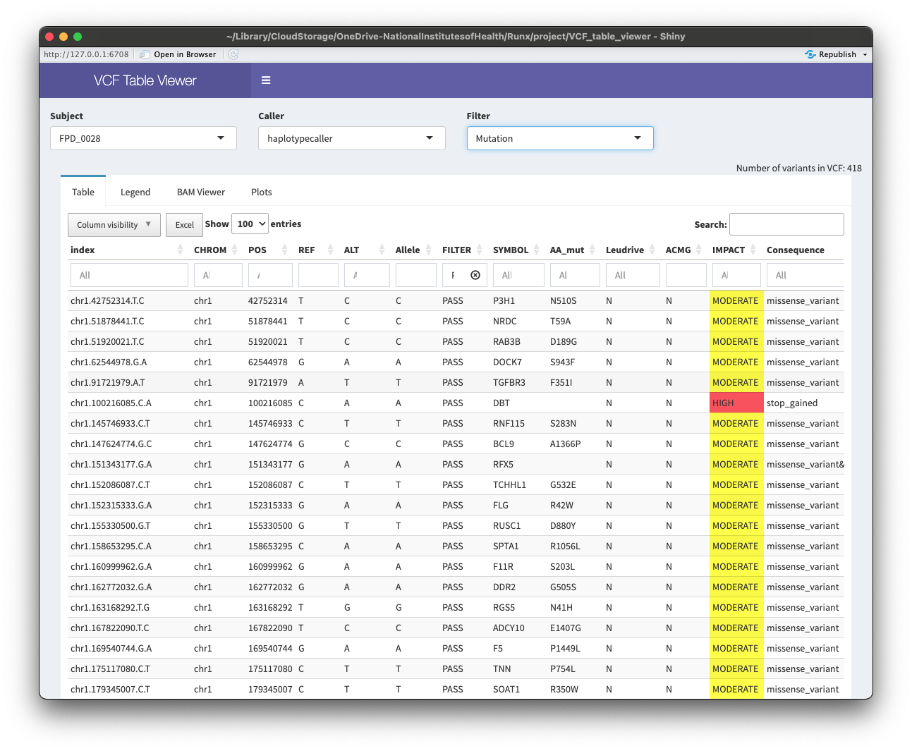

# VCF Table Viewer

## Background

Variant calling pipelines produce variant caller format (VCF) files.  VCF files have large amounts of information about called variants, especially if they are annotated by tools such as VEP, but are difficult to read and interpret directly, particularly for non-computational biologists.  Thus, there are many tools available to extract information from VCF files for visualization and analysis.  VCF Table Viewer is a Shiny app that extracts information from annotated VCF files produced by the sarek variant calling pipeline from Nextflow Core and displays them in an interactive table.  The table provides the ability to flexibly sort through a list of called variants while visualizing desired annotations, including color highlighting of various annotations.  It also allows easy visualization of the bam file pileups in an embedded IGV tab for variants selected in the table, as well as plots of somatic allele frequencies from mutect2 calls over multiple samples.  VCF Table Viewer provides a novel interface that facilitates the examination of variant calls by non-computational biologists. 

## Implementation

The current version of VCF Table Viewer is tightly organized around the output from the Nextflow-core [sarek](https://nf-co.re/sarek/3.5.1/) pipeline (v3.5.1), 
as well as the specific sample naming conventions used in our WES study.  The individual IDs, sample IDs, and germline/somatic designations are obtained from the samplesheet.csv used for the sarek run.
The current filtering levels and corresponding filenaming conventions are hard-coded and would need to be edited to match your file names. 
There is a list of specific genes to highlight (Gene_lists.txt), which currently requires columns with Leudrive and ACMG, each with a list of gene symbols.  These can be adapted to the users needs. 
To use the BAM Viewer you will also need to edit the bamDir reactiveValue and the filenames. It makes use of existing R  packages [vcfR](https://cran.r-project.org/web/packages/vcfR/index.html) (Github [repo](https://github.com/knausb/vcfR)) and [igvShiny](https://www.bioconductor.org/packages/release/bioc/html/igvShiny.html) (Github [repo](https://github.com/gladkia/igvShiny)).

